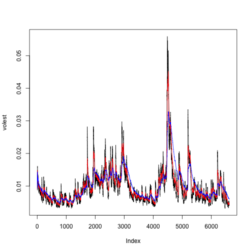

### 
### S&P 500 Volatility chart
### By Charles McCann
### 6306 section 405


```r
library(knitr)
library(markdown)
library(tseries)
```

### S&P 500 (^GSPC)
###    SNP - SNP Real Time Price. Currency in USD
[Link to GitHub repository](https://github.com/ctmccann/SNP500)

###Download the data of SP500 '^gspc'.


```r
SNPdata <- get.hist.quote(instrument="^GSPC",quote="Close")
```
### Calculate the log returns, which is the subtractration of log(lag(SNPdata)) and log(SNPdata)

```r
SNPret <- log(lag(SNPdata)) - log(SNPdata)
```
### Calculate volatility measure that is to multiply sd(SNPret),sqrt(250), 100

```r
SNPvol <- sd(SNPret)*sqrt(250)*100
```

### Define getVol function for volatility

```r
getVol <- function(d, logrets) {
	var = 0
	lam = 0
	varlist <- c()

	for (r in logrets) {
		lam = lam*(1 - 1/d) + 1
	  var = (1 - 1/lam)*var + (1/lam)*r^2
		varlist <- c(varlist, var)
	}

	sqrt(varlist)
}
```

### Calculate volatility over entire length of series for various three different decay factors: 10 30. 100


```r
volest <- getVol(10,SNPret)
volest2 <- getVol(30,SNPret)
volest3 <- getVol(100,SNPret)
```

### Plot the results, overlaying the volatility curves on the data, just as was done in the S&P example.

```r
plot(volest,type="l")
lines(volest2, col="red", type="l")
lines(volest3, col="blue", type="l")
```


